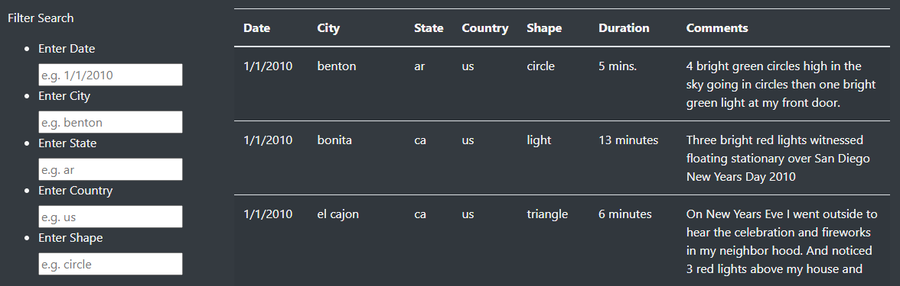
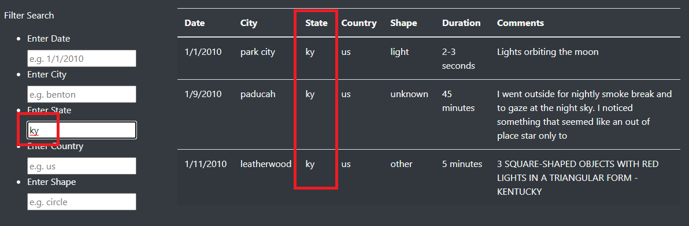
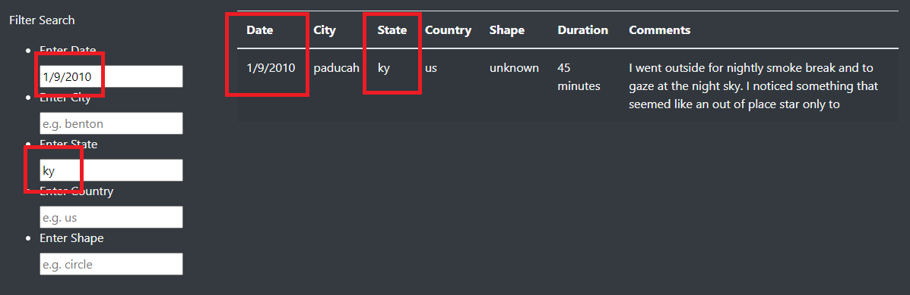

# UFOs

## Resources

*   Data source
    *   

*   Software
    *   Visual Studio Code 1.63.2

## Overview

The purpose of this project was the take UFO sighting information stored in the  array and display it in a web browser via HTML. The data needed to be in a table format and filterable with user inputs (i.e. date, state, etc.)

## Results/Instructions

The app it self is reactive to user inputs, so when the user types in one or more of the filter boxes and hits enter the table automatically updates to reflect the users desired information. This is demonstrated in the images below. The web app itself is also stylized with a dark theme and examples of how to filter the table (the "e.g." texts within the boxes).

#### Image of the unfiltered table

#### Image of the table filtered for the state "ky"

#### Image of the table with multiple filters

## Summary
There are two drawbacks to this design and both pertain to the filtering process. 

First, and most likely to cause issues, is the users text needs to match **exactly** how the table is formatted when filtering. For example, if the users were to type in "KY" or "1-9-2010" rather than "ky" or "1/9/2010" in the filter boxes the table will not filter. This is why the added e.g. text was added, hopefully preventing user input errors. The better solution would be to add code to be able to adjust for multiple ways to handle user inputs.

The second drawback is the lack of instructions for using the filter. Adding one or two sentences, of even just a warning of the above issue, for how to use the filters would be a great help for users to avoid confusion.
